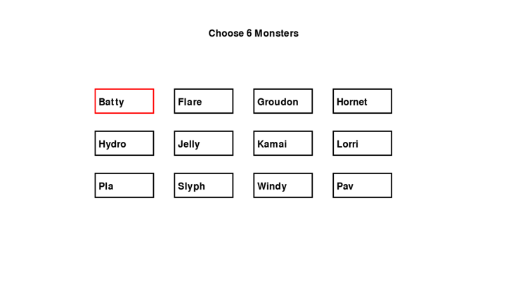
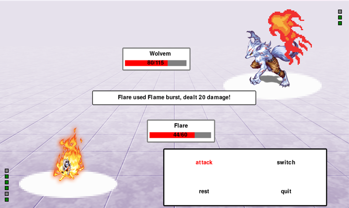

# **Monster Tamer - Demo**

Monster Tamer is a turn based battle demo game built with Python and Pygame mainly. The player chooses 6 monsters and battles against a opponent which has 3 strong monsters. Each monster is unique and has its own element type and abilities.Strategic decisions and elemental matchups are at the core of the gameplay.

## **Features**

<li>Turn Based Combat System</li>
<li>Elemental System</li>
<li>Unique Monsters</li>
<li>Elemental Strength/Weakness Mechanic</li>
<li>Visual & Audio Effects</li>

## **Screenshots**

 
 
 

## **Controls**
<pre>
  <ins>Key</ins>                                <ins>Action</ins>  
← ↑ ↓ →    	          Navigate menus & selection  
Enter/Space	          Confirm selection / attack  
Backspace/ESC	               Cancel / go back
</pre>
## **Installation**
1. Extract ZIP
2. Open Monster-Tamer-main folder
3. Open Monster Tamer folder
4. Open main.py with Python
   (if that does not work, try to open with visual studio code (trust author) and open from there)

## **Plans for the full version**
<li>Monster stat screens and details</li>
<li>Tournament system with different opponents that get stronger each tour</li>
<li>More monsters,abilities,effects </li>
<li>Better UI</li>

## **About Project and Developer**

This project is a personal demo and learning project for my course BME268. 
Contact: furkan412002@gmail.com

 

